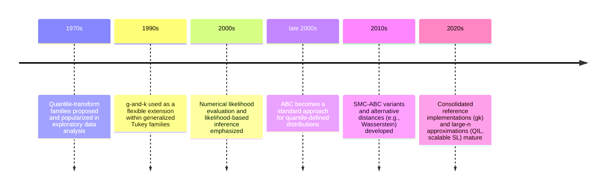

# Exact Posterior Sampling for the g-and-k Distribution

## Executive summary

The univariate g-and-k distribution is most commonly specified by its quantile function (inverse CDF) rather than a closed-form density. This is why it is frequently labeled “likelihood-intractable” in the likelihood-free inference literature, despite the fact that its likelihood is *numerically evaluable* through one-dimensional inversion. citeturn4view0turn28view0

Exact posterior sampling in the usual MCMC sense (i.e., a Markov chain with invariant distribution equal to the *true* posterior under the g-and-k model) is feasible whenever you can compute the density (or, equivalently, the log-likelihood) to sufficient numerical accuracy at proposed parameter values. The key identity is a change-of-variables formula: for each observation $x$, the density can be written as $f(x \mid \theta)=\varphi(z)/Q'(z)$ where $z$ solves $Q(z;\theta)=x$. citeturn4view0turn8view7turn8view8

In practice, the bottleneck is that evaluating $f(x\mid\theta)$ for $n$ observations requires $n$ one-dimensional root-finds (plus evaluation of a known derivative). This makes exact-likelihood MCMC comparatively expensive, often motivating approximate methods such as ABC (including Wasserstein ABC), synthetic likelihood, or quantile-implied likelihood. citeturn4view0turn8view7turn12view0turn30view0turn20view0

No non-degenerate “data augmentation” for exact g-and-k observations eliminates the root-finding, because the natural latent variable ($Z\sim\mathcal N(0,1)$) is deterministically pinned down by $x$ given $\theta$ when $Q(\cdot;\theta)$ is strictly increasing. Augmentation becomes useful only if you introduce additional stochasticity (e.g., measurement error, censoring, rounding/interval observations), which changes the likelihood model. citeturn4view0turn8view7

If computational limits prohibit exact-likelihood posterior sampling, the lowest-approximation alternatives with interpretable error control are: (i) Wasserstein ABC with $\varepsilon\to0$ consistency results (but still an $\varepsilon$-coarsened target at finite tolerance), and (ii) quantile-implied likelihood, which yields an asymptotically justified approximate likelihood based on multivariate CLTs for sample quantiles. citeturn30view0turn20view0turn30view1

## Definition and properties of the g-and-k distribution

### Quantile-based definition

Let $Z\sim\mathcal N(0,1)$ and define the g-and-k random variable
$$
X = Q_{\text{gk}}(Z;A,B,g,k,c)
= A + B\,(1+c\,\tanh(gZ/2))\,Z\,(1+Z^2)^k.
$$
Equivalently, if $U\sim\mathrm{Unif}(0,1)$ and $z(u)=\Phi^{-1}(u)$, the quantile function of $X$ is $F_X^{-1}(u)=Q_{\text{gk}}(z(u);\theta)$. citeturn4view0turn8view6

Interpretation (heuristic but standard in this family): $A$ is a location parameter, $B>0$ is a scale parameter, $g$ modulates asymmetry (skewness), $k$ modulates tail “elongation” (kurtosis / tail weight), and $c$ is often fixed at $0.8$ by convention. citeturn4view0turn8view6

### Parameter validity and monotonicity constraints

A well-defined continuous distribution requires the quantile function to be strictly increasing (for all $u\in(0,1)$, equivalently for all $z\in\mathbb R$). For the g-and-k, validity does not depend on $A$ and it requires $B>0$, but it places nontrivial constraints on $(g,k,c)$. citeturn4view0turn25view2

Useful sufficient conditions emphasized in the modern “gk” reference implementation are: focusing on $c\ge 0$, any $k<-1/2$ is invalid; for $k\ge 0$ the distribution is valid whenever $0\le c<c^\star\approx0.83$ (hence the common choice $c=0.8$). citeturn25view2turn8view8

For $c=0.8$, validity for $-0.5\le k<0$ is subtler; the same source proposes a practical sufficient rule (empirically supported by a numerical boundary fit) of
$$
k \;\ge\; \max\{-0.5,\;\tilde k(g)\},\qquad \tilde k(g)=-0.045-0.01g^2,
$$
as a “safe” region for inference workflows, while also providing a numerical validity checker based on minimizing the derivative. citeturn25view3turn25view2

Negative $k$ can yield lighter-than-normal tails and can also produce bimodal shapes that may be undesirable in many applications, so many practitioners restrict to $k\ge 0$ for stability and interpretability. citeturn4view0turn8view6

### Tail behavior and moments

Because $X$ is a smooth (polynomially growing) transform of a Gaussian variable, $X$ has stretched-exponential tails: for large $|z|$, $Q_{\text{gk}}(z)$ behaves like a constant times $z^{2k+1}$, so the induced tail decay is heavier than Gaussian when $k>0$ but still faster than any power-law. This “Tukey transform” viewpoint and the role of g-and-k models as flexible skew/heavy-tail families are emphasized in applied reviews of Tukey-transform distributions. citeturn24view0turn4view0

## Why the likelihood is “intractable” and how it is computed exactly

### The core difficulty: quantile form implies inversion

The g-and-k distribution is specified via a quantile function rather than an explicit CDF/PDF. To compute $F(x)$ or $f(x)$ at a given $x$, one must invert the mapping $x=Q_{\text{gk}}(z;\theta)$ to find $z$, which has no closed form for general $(g,k,c)$. citeturn4view0turn8view7turn28view0

A standard stable strategy is to solve the scalar equation
$$
Q_{\text{gk}}(z;\theta)-x = 0
$$
for $z$, then map to $u=\Phi(z)$ if the CDF is needed. Solving for $z$ directly (rather than solving for $u$) is reported to be more numerically stable near extreme probabilities. citeturn4view0turn8view7

### Exact density via change of variables

Assume $Q_{\text{gk}}(\cdot;\theta)$ is strictly increasing, so it is invertible and differentiable. With $Z\sim\mathcal N(0,1)$ and $X=Q(Z)$, the density of $X$ is
$$
f(x\mid\theta) \;=\; \frac{\varphi(z)}{Q'(z)}\quad\text{where } z=Q^{-1}(x).
$$
This is the standard one-dimensional change-of-variables formula applied to the deterministic transform $X=Q(Z)$. citeturn4view0turn8view7

For g-and-k, an explicit closed form for $Q'(z)$ exists (it is algebraic in $z$ with $\tanh$ and $\mathrm{sech}^2$ terms), so once $z$ is found by root-solving, the density follows without numerical differentiation. citeturn8view8turn4view0

### Computational cost and scaling

In the reference “gk” implementation, quantile evaluation and simulation are relatively cheap, but CDF/PDF evaluation is orders of magnitude slower due to root-finding. A microbenchmark table reports (illustratively) that PDF evaluation is roughly $375\times$ slower than a standard normal density evaluation for one representative parameter setting, and CDF evaluation roughly $457\times$ slower. citeturn8view7

A directly relevant implication for posterior sampling is that each log-likelihood evaluation for $n$ i.i.d. observations costs about $n$ one-dimensional inversions, so exact-likelihood MCMC becomes expensive for even moderately large $n$ under naive implementations. citeturn12view0turn8view7

A compact reproduction of the cited microbenchmark (mean microseconds per operation) is:

| Operation | Normal | g-and-k | g-and-h | Ratio g-and-k vs normal | Ratio g-and-h vs normal |
|---|---:|---:|---:|---:|---:|
| Quantile | 175 | 972 | 445 | 5.56 | 2.55 |
| Random sampling | 150 | 921 | 436 | 6.15 | 2.91 |
| CDF | 313 | 143,151 | 116,928 | 457 | 374 |
| PDF | 369 | 138,381 | 111,279 | 375 | 302 |

citeturn8view7

## Exact posterior sampling methods and rigorous algorithms

### What “exact” can mean here

There are two distinct notions often conflated in discussions of g-and-k inference:

* **Exact target**: the algorithm’s stationary/invariant distribution is the *true posterior* $\pi(\theta\mid x_{1:n})$ under the g-and-k likelihood.
* **Exact i.i.d. posterior draws**: independent samples from $\pi(\theta\mid x_{1:n})$ without asymptotic limits.

For g-and-k, the first notion is achievable with standard MCMC/SMC because the likelihood is numerically evaluable via 1D inversion. The second notion is generally not available for nonconjugate continuous-parameter models, and there is no known special structure making perfect simulation practical for the full $(A,B,g,k)$ posterior. citeturn4view0turn28view0

Below, “exact” refers to *exact targeting* (standard in computational Bayesian statistics).

### Exact-likelihood Metropolis–Hastings on $(A,B,g,k)$

Given a prior density $\pi(\theta)$ and i.i.d. data, the posterior satisfies
$$
\pi(\theta\mid x_{1:n}) \propto \pi(\theta)\prod_{i=1}^n f(x_i\mid\theta),
$$
with $f$ computed by the inversion-plus-derivative identity above. citeturn4view0turn8view7

A random-walk Metropolis–Hastings scheme using this exact log-likelihood leaves the posterior invariant by construction. The “gk” reference implementation uses Metropolis–Hastings and recommends an adaptive covariance scheme (Adaptive Metropolis) to reduce manual tuning. citeturn12view0turn4view0

Practical note: the same implementation recommends reparameterizing $B$ as $\log B$ because the log-likelihood surface can become extremely steep for $B$ near $0$, harming both optimization and MCMC. citeturn12view2turn4view0

#### Pseudocode for an exact-likelihood MH kernel

```text
Inputs:
  data x[1:n]
  prior log π(θ)
  proposal covariance Σ
  initial θ0

For t = 1..T:
  propose θ' ~ N(θ_{t-1}, Σ)

  compute loglik(θ') = sum_i log f(x_i | θ')
    where for each i:
      solve Q(z; θ') = x_i for z   (1D root find)
      compute log f = log ϕ(z) - log Q'(z)

  compute loglik(θ_{t-1}) similarly (cache from last step)

  accept with probability α = min{1, exp[ logπ(θ') + loglik(θ') - logπ(θ_{t-1}) - loglik(θ_{t-1}) ] }

  set θ_t = θ' if accepted else θ_{t-1}
```

This targets the exact posterior if `loglik(·)` is evaluated exactly (mathematically); in practice it targets a numerically perturbed posterior because of finite-precision root finding and arithmetic.

### Exact-likelihood HMC/NUTS via implicit differentiation (feasible in principle)

If you want gradient-based sampling (HMC/NUTS), you need $\nabla_\theta \log f(x\mid\theta)$.

Set $G(z,\theta)=Q(z;\theta)-x$ and let $z(\theta)$ solve $G(z(\theta),\theta)=0$. By the implicit function theorem,
$$
\frac{\partial z}{\partial \theta_j} = -\frac{\partial_\theta Q(z;\theta)_j}{Q'(z;\theta)}\Bigg|_{z=z(\theta)}.
$$
Then
$$
\log f(x\mid\theta)=\log \varphi(z(\theta))-\log Q'(z(\theta);\theta),
$$
and you can apply chain rule. The key point is that all needed derivatives exist in closed form except for $z(\theta)$, whose sensitivities are obtained from the implicit derivative above. The same reference implementation supplies closed-form expressions for $Q'(z;\theta)$ for g-and-k, which is the critical ingredient. citeturn8view8turn8view7turn4view0

This provides a route to “exact” HMC (exact target, numerical arithmetic aside) in differentiable programming frameworks, but it is substantially more engineering work than MH and still incurs $n$ root solves per gradient evaluation.

### Why standard data augmentation does not help for exact g-and-k observations

A tempting latent-variable view is $X_i = Q(Z_i;\theta)$ with $Z_i\sim\mathcal N(0,1)$. However, when $Q(\cdot)$ is strictly increasing, $Z_i$ is uniquely determined from $X_i$ given $\theta$ (it is exactly the inversion $z_i=Q^{-1}(x_i;\theta)$). Thus, the conditional distribution of $Z_i$ given $(X_i,\theta)$ is degenerate; Gibbs-style augmentation does not introduce a tractable conditional that avoids inversion. citeturn8view7turn4view0

Augmentation becomes meaningful only if your observation model changes so that $X_i$ is no longer a noiseless deterministic transform (e.g., $Y_i = Q(Z_i;\theta)+\epsilon_i$ with measurement noise, or interval censoring/rounding), which is a different likelihood than the standard g-and-k i.i.d. model.

### Pseudo-marginal MCMC and unbiased likelihood estimators

If a likelihood is truly unavailable but you can compute a **nonnegative unbiased estimator** $\widehat L(\theta)$ of $L(\theta)$, pseudo-marginal MCMC constructs an extended-state MH algorithm that targets the exact posterior marginally in $\theta$. citeturn30view2turn13search3

For g-and-k, pseudo-marginal machinery is conceptually relevant but typically unnecessary because the likelihood is already evaluable via inversion. Its practical relevance would arise only if you deliberately replace the exact likelihood with an unbiased estimator to reduce cost (e.g., a sophisticated subsampling-with-control-variates construction), which is not standard in the g-and-k literature and introduces its own stability/variance tradeoffs. citeturn30view2turn13search0

## Approximate and minimal-approximation alternatives and error quantification

### Comparison table of posterior sampling methods

| Method | Exact vs approximate | Assumptions | Computational cost (typical) | Pros / cons | References |
|---|---|---|---|---|---|
| Exact likelihood + MH (random-walk / Adaptive Metropolis) | Exact target (up to numerical root-solving error) | i.i.d. data; valid parameter region; ability to solve $Q(z)=x$ and evaluate $Q'(z)$ | $\mathcal O(n \cdot C_{\text{root}})$ per iteration | Simple, robust; expensive for large $n$; strong posterior correlations; needs careful parameter constraints | citeturn12view0turn4view0turn8view7 |
| Exact likelihood + gradient MCMC (HMC/NUTS with implicit grads) | Exact target (up to numerical error) | Same as above + differentiability; implement implicit differentiation | Often higher per-iter cost than MH (roots + gradients); fewer iterations may be needed | Better exploration in correlated posteriors; more complex and numerically delicate | citeturn8view8turn4view0 |
| Exact likelihood + SMC / importance sampling on $\theta$ | Exact target (up to numerical error) | Need proposal / tempering schedule; likelihood evaluable | Many likelihood evals; parallelizable | Parallel-friendly; can estimate evidence; sensitive to proposal degeneracy | citeturn4view0turn8view7 |
| ABC rejection (summary-based) | Approximate (ABC posterior) | Simulator available; chosen summaries; tolerance/acceptance rule | Simulation-dominated; no root finding | Very easy; but approximation depends strongly on summaries and tuning | citeturn12view1turn4view0turn30view1 |
| Wasserstein ABC | Approximate; consistency as $\varepsilon\to0$ (under conditions) | Simulator available; distance between empirical distributions; threshold $\varepsilon$ | Wasserstein computation + simulation; scalable approximations available | Reduces summary design; still a coarsened target for finite $\varepsilon$ | citeturn30view0 |
| Bayesian synthetic likelihood (BSL) | Approximate (Gaussian summary model) | Summary statistics approximately multivariate normal; simulation feasible | Many simulated datasets per $\theta$; can be heavy | Avoids root-finding; can work well; misspecification risk in summary normality | citeturn23search1turn23search5turn23search8 |
| Quantile-implied likelihood (QIL) | Approximate (asymptotic quantile CLT) | Large-sample asymptotics for selected sample quantiles; uses model quantiles | Very cheap per $\theta$ once quantiles chosen; scales to huge $n$ | “Low tuning”; interpretable asymptotic basis; not exact at finite $n$ | citeturn20view0 |
| Noisy/perturbed MCMC using approximate likelihood evaluations | Approximate; error can be bounded under stability conditions | Requires control on kernel perturbation; typically geometric ergodicity of ideal chain | Often cheaper than exact; quality depends on approximation | Enables tradeoff; must quantify bias | citeturn13search0turn13search5 |

### ABC and Wasserstein ABC: approximation and asymptotics

ABC replaces the likelihood with an acceptance mechanism based on simulated-vs-observed proximity in a summary space. The “gk” reference implementation includes a basic ABC rejection sampler and emphasizes that the output is an approximation whose quality depends on the summary choice and tuning parameters. citeturn12view1turn4view0

General asymptotic theory shows that ABC posterior concentration and Bernstein–von Mises–type behavior depend on how the tolerance $\varepsilon$ shrinks with $n$ and on identification conditions for the chosen summary statistics. This provides a principled way to reason about approximation error, but it does not remove the need to choose summaries (unless you move to summary-free discrepancies). citeturn30view1

Wasserstein ABC replaces ad hoc summaries with a discrepancy between empirical distributions. It comes with results showing that the Wasserstein-ABC posterior can approximate the true posterior arbitrarily well as the threshold $\varepsilon\to 0$, while also highlighting regimes in which it behaves differently due to misspecification and dimensional effects. citeturn30view0

### Synthetic likelihood and “exact-approximate” pseudo-marginal variants

Synthetic likelihood methods replace the likelihood of the full data with a multivariate normal likelihood on chosen summaries, whose mean/covariance are estimated by repeated simulation at each $\theta$. This trades root finding for repeated simulation. citeturn23search1turn23search5

Some synthetic-likelihood constructions admit unbiased likelihood estimators for the synthetic likelihood (under normality conditions), allowing pseudo-marginal MCMC to be “exact” for the *synthetic-likelihood posterior* (still an approximation to the true posterior). This places synthetic likelihood in the “exact-approximate” category: exact MCMC for an approximate target. citeturn30view2turn23search5

### Quantile-implied likelihood as a minimal-approximation route for large n

Quantile-implied likelihood (QIL) constructs an approximate likelihood from a pivotal quantity based on the Mahalanobis distance between selected sample quantiles and model quantiles, leveraging asymptotic multivariate normality of sample quantiles. The resulting QIL is an asymptotic $\chi^2_d$ density and can be combined with any standard posterior computation method. citeturn20view0

For g-and-k specifically, QIL is attractive because model quantiles are cheap to compute (they are explicit in terms of $z(u)$), even when the PDF is expensive. The approximation error is asymptotic: it is controlled by the CLT accuracy for sample quantiles and by the choice/number $d$ of quantile levels used (with $d\le n$). citeturn20view0turn4view0

### Quantifying “numerical approximation” error in exact-likelihood MCMC

Even when targeting the true posterior conceptually, implementations compute $z=Q^{-1}(x)$ by numerical root finding with finite tolerance. This yields a perturbed log-likelihood $\widehat\ell(\theta)$.

Two practical ways to quantify the impact are:

1) **Direct posterior perturbation bound (deterministic)**: if you can guarantee for all $\theta$ in the region explored that $|\widehat\ell(\theta)-\ell(\theta)|\le \delta$, then the unnormalized posterior density is perturbed by at most a multiplicative factor $e^{\pm\delta}$, bounding posterior ratios. (This is a straightforward consequence of exponentiating the log error.)

2) **Noisy/perturbed kernel bounds (Markov chain stability)**: general results bound the distance between the distribution of an “ideal” MH chain and a perturbed chain when the transition kernel is close, under uniform or geometric ergodicity assumptions. This literature is directly relevant to likelihood approximations and “Monte Carlo within Metropolis” perturbations. citeturn13search0turn13search5

Operationally, for g-and-k, the simplest approach is to run sensitivity checks over root tolerances (e.g., tighten tolerance by 10–100× and verify that posterior summaries and acceptance rates are stable within Monte Carlo error), and to monitor whether the root solver ever fails or brackets incorrectly—both are more consequential than sub-ULP rounding in typical workflows. citeturn4view0turn25view2

## Practical implementation details and validation experiments

### Priors, constraints, and identifiability

Because validity constraints are nontrivial, a practical prior should incorporate them explicitly (hard constraints) rather than relying on runtime failures. The “gk” reference workflow commonly fixes $c=0.8$ and constrains $B>0$ and (often) $k\ge 0$ to guarantee validity. citeturn25view2turn8view6

A common pragmatic reparameterization is $(A,\log B,g,k)$; beyond constraining $B>0$, it improves numerical behavior because the log-likelihood can be extremely steep near $B\approx 0$. citeturn12view2turn4view0

One concrete prior example used in the “gk” paper’s case study (in the $(A,\log B,g,k)$ parameterization) corresponds to an improper uniform prior on $(A,B,g,k)$ with constraints, implemented by using a log prior proportional to $\log B$ and an indicator enforcing $k>0$ (and implicitly $B>0$ via $\log B$). citeturn12view2turn12view0

### Numerical inversion of the quantile transform

For each $x_i$ and proposed $\theta$, you need $z_i$ solving $Q(z_i;\theta)=x_i$.

Implementation recommendations grounded in the reference implementation:

* Solve for **$z$ directly** using a bracketed 1D root finder. This avoids numerical issues near $u\approx 0$ or $1$ that arise if you instead solve directly for $u$ in $Q(z(u);\theta)=x$. citeturn8view7turn4view0
* Use the **closed-form $Q'(z;\theta)$** rather than numerical differentiation; derivative formulas are explicit and reduce noise. citeturn8view8turn8view7
* Cache and warm-start: for MH proposals that move locally in $\theta$, the previous iteration’s $z_i$ values are excellent initial guesses for Newton-type methods (while still retaining bracketing safeguards). This is not specific to the cited implementation, but it is a high-leverage engineering optimization given the per-iteration cost profile. citeturn8view7turn12view0

### Computational cost and parallelization

The per-iteration cost of exact-likelihood MCMC scales roughly linearly in $n$ because each observation requires a separate inversion. This is the primary reason exact-likelihood MCMC is often reserved for modest $n$ or used as a “ground truth” baseline for approximate methods. citeturn12view0turn8view7turn28view0

If $n$ is large, consider:

* Switching targets: QIL (quantiles only) or synthetic likelihood (summaries only) drastically reduces per-iteration cost. citeturn20view0turn23search1
* Parallelizing inner loops: likelihood evaluation across $i=1,\dots,n$ is embarrassingly parallel once a parameter proposal is fixed.

### Diagnostics for exact-likelihood samplers

Use standard Bayesian computation diagnostics, but tailor them to g-and-k pathologies:

* **Validity diagnostics:** monitor and reject proposals that violate monotonicity/validity constraints; optionally pre-screen with a validity function (noting it can be expensive and not guaranteed to find the global minimum). citeturn25view2
* **MCMC convergence/mixing:** trace plots, autocorrelation, ESS/time. The cited case study illustrates trace plots and emphasizes sensitivity to initialization for adaptive Metropolis. citeturn12view3turn12view0
* **Posterior predictive checks:** overlay fitted densities and QQ plots against observed data; the reference workflow includes both. citeturn12view4turn12view3

### Recommended workflow for practitioners

A stable, reproducible workflow consistent with the primary implementations is:

1) **Fix a working parameterization and validity regime.** Default: fix $c=0.8$, work in $(A,\log B,g,k)$, restrict to $k\ge 0$ unless you have a strong reason otherwise. citeturn25view2turn12view2turn8view6

2) **Do a fast pilot for localization.** Use ABC (summary-based) to roughly localize the posterior and identify an initial region, or use a fast likelihood-based optimizer/approximation (the “gk” ecosystem includes both ABC and a stochastic-approximation optimizer (FDSA) for MLE-like localization). citeturn12view1turn12view2turn4view0

3) **Run exact-likelihood MCMC as the main inference engine** if $n$ is feasible. Use adaptive Metropolis (or a well-tuned proposal) initialized from the pilot. citeturn12view0turn12view3

4) **Scale-up path when exact likelihood is too slow.** Prefer QIL when $n$ is very large and quantiles are reliable; prefer Wasserstein ABC when you want a summary-free discrepancy and can afford simulation; prefer BSL when you have high-quality approximately normal summaries. citeturn20view0turn30view0turn23search5

5) **Validate with simulation-based calibration (SBC) and posterior predictive checks.** For likelihood-free methods especially, SBC reveals systematic bias or under/over-dispersion induced by summaries, tolerances, or approximations. General ABC theory emphasizes the role of identification and tolerance scaling in posterior behavior, motivating SBC as a routine check. citeturn30view1turn30view0

### Example simulation experiments to validate samplers

A compact experimental suite that cleanly separates “exact target” vs “approximate target” behavior:

**Experiment design.** Choose a “true” parameter $\theta^\star=(A^\star,B^\star,g^\star,k^\star)$ in a valid region (e.g., $c=0.8$, $B^\star>0$, $k^\star\ge 0$). Generate $R$ replicated datasets of sizes $n\in\{100,1000,10000\}$ by $Z\sim\mathcal N(0,1)$ and $X=Q(Z;\theta^\star)$. citeturn8view6turn4view0

**Samplers compared.**
- Exact-likelihood adaptive Metropolis MH.
- Wasserstein ABC SMC (or rejection) at a grid of $\varepsilon$ values.
- BSL at a grid of simulation counts $M$ per $\theta$.
- QIL at a grid of quantile counts $d$. citeturn12view0turn30view0turn23search5turn20view0

**Metrics.**
- Posterior mean RMSE: $\|\mathbb E[\theta\mid x]-\theta^\star\|$ across replicates.
- Marginal coverage: for each component, empirical coverage of 50%/90% credible intervals.
- ESS per second for MCMC-based methods.
- For approximate methods, divergence to a “gold standard” (e.g., KL or Wasserstein distance between approximate posterior samples and the exact-likelihood posterior sample for the same dataset). citeturn12view0turn30view0turn30view1

**Plots.**
- SBC rank histograms (per parameter) comparing approximate vs exact-likelihood posterior draws.
- Trace/ACF and pair plots for the exact-likelihood sampler.
- Posterior predictive density overlays and QQ plots against held-out replicated data. citeturn12view4turn12view3turn30view1

### Software and implementation references

Primary implementations and code bases explicitly tied to g-and-k workflows include:

* **gk R package** (distribution functions + ABC + exact-likelihood MCMC + validity checks) and its accompanying paper. citeturn4view0turn26view0
* **winference R package** (Wasserstein-ABC tooling; includes g-and-k examples and tutorial material referenced by an implementation note on exact likelihood computations). citeturn26view1turn28view0
* **BSL R package** documentation (synthetic likelihood workflows, not g-and-k-specific but commonly used for simulator-based models). citeturn23search8turn15search7
* **sbi toolkit** for simulation-based inference (neural posterior/likelihood/ratio estimation; useful if treating g-and-k as a benchmark or if amortization is desired). citeturn22search8turn26view2
* **distributional R package** includes a g-and-k distribution object with the quantile-based definition and parameter constraints; useful for composition in modeling pipelines. citeturn27view0

## Mermaid diagrams

### Exact-likelihood posterior sampling flow

```mermaid
flowchart TD
  A[Choose parameterization and prior] --> B[Enforce validity constraints]
  B --> C[Initialize theta0 (pilot via ABC/FDSA)]
  C --> D[Propose theta' (RW or adaptive covariance)]
  D --> E[For each xi: solve Q(z;theta') = xi]
  E --> F[Compute loglik(theta') = sum log phi(z) - log Q'(z)]
  F --> G[Compute MH acceptance using log prior + loglik]
  G --> H{Accept?}
  H -->|Yes| I[theta_t = theta']
  H -->|No| J[theta_t = theta_{t-1}]
  I --> D
  J --> D
```

### High-level timeline of key milestones

